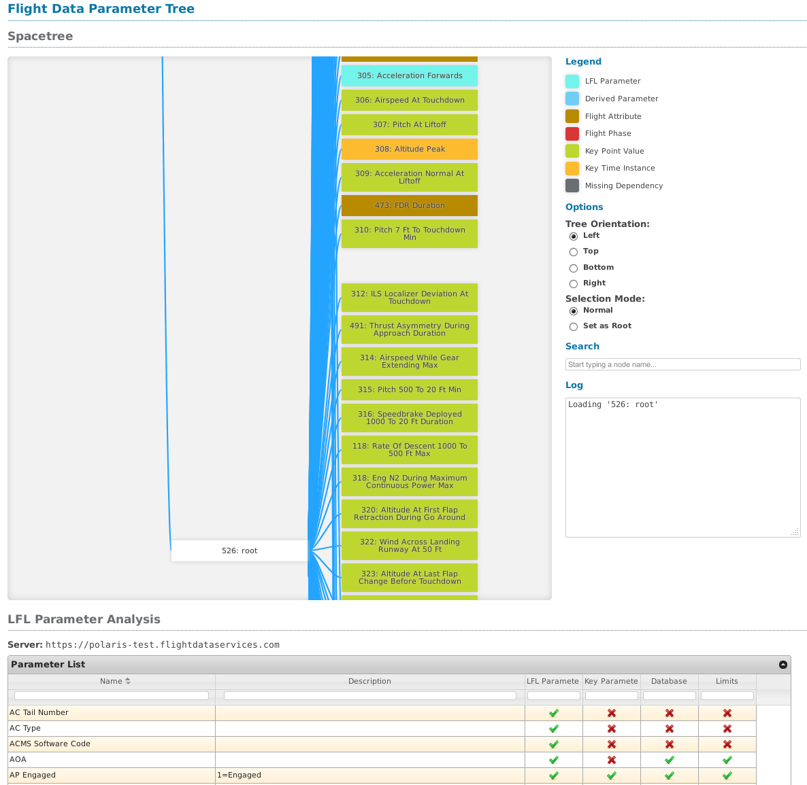
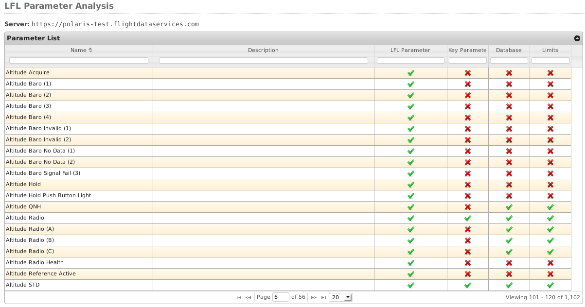
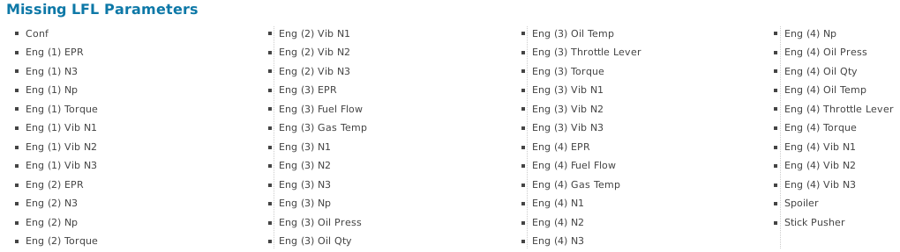

=======================
FlightDataParameterTree
=======================

The `FlightDataParameterTree` is an web-based application which displays the dependency tree of an HDF file. It also displays a table containing parameter information for completing and correcting logical frame layouts.

-------------------
Starting the server
-------------------

The `FlightDataParameterTree` server is created by running the `flightdataparametertree.server` module. An instance of a web browser will be load the application automatically.

.. code-block:: bash
   
   $ python server.py
   FlightDataParameterTree (c) Copyright 2013 Flight Data Services, Ltd.
    - Powered by POLARIS
    - http://www.flightdatacommunity.com
   
   Spacetree server is running at http://localhost:8080/
   Quit the server with CONTROL-C.
   Registering additional web browsers...
   Launching viewer in a web browser...

The URL of the application is `http://localhost:8080/spacetree`.

--------------------
Loading the HDF file
--------------------

An HDF file created by the `FlightDataAnalyzer` must be provided to use the `FlightDataParameterTree` tool.

.. image:: load_hdf_file.png

Click on the `Browse` button, select an HDF file and finally click on the `Submit Query` button to process the HDF file.

--------------
Parameter Tree
--------------

The parameter tree visualises the dependency tree used to create the HDF file. Each node of the tree is one of the following:

* `LFL Parameter`
* `Derived Parameter`
* `Flight Attribute`
* `Flight Phase`
* `Key Point Value`
* `Key Time Instance`
* `Missing Dependency`

Clicking and dragging the background of the tree will change the view.

Clicking on a node will rearrange the tree to show the node's dependencies.

Nodes may be searched for by entering a partial name into the `Search` text input field.

----------------------
LFL Parameter Analysis
----------------------

This section includes a table of information regarding the parameters stored within the HDF file.

Columns:

* `LFL Parameter` - Whether or not the parameter is defined in the LFL.
* `Key Parameter` - Whether or not the parameter is a considered to be a key parameter for flight data monitoring.
* `Database` - Whether or not the parameter exists within the POLARIS database.
* `Limits` - Whether or not the parameter has validation limits defined within the POLARIS database.

Every column within the table can be searched by entering a partial match into the text fields which appear below the column headers. For searching on boolean columns enter either `tick` or `cross`.

----------------------
Missing LFL Parameters
----------------------

A list of missing LFL parameters is displayed at the bottom of the page. This is a list of common parameters which have not been found within the HDF file, but are expected to exist in the majority of LFLs.

Some parameters included in this list may not be required, for instance engine parameters for engines numbered 3 and 4.